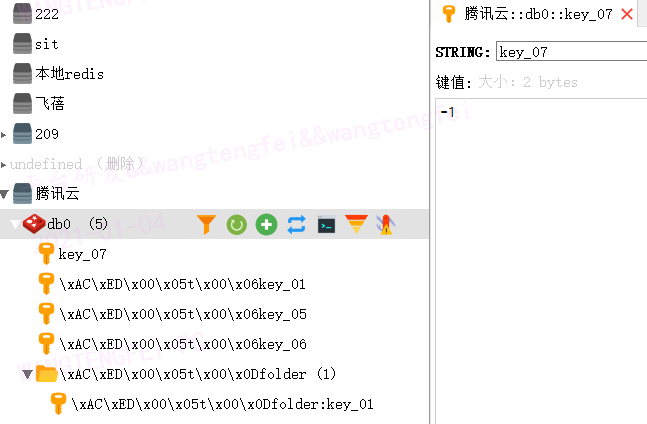

0. linux中redis设置密码
   redis-cli
   # 查看有没有设置密码
   config get requirepass
   # 设置密码
   config set requirepass abcdefg
   
1. 插入redis并存在文件夹中,:分割代表文件夹
```
        redisTemplate.opsForValue().set("folder:key_01","kv放在指定文件夹中");
        redisTemplate.opsForValue().get("folder:key_01")
        System.out.println();
        
        //插入redis
        redisTemplate.boundValueOps("key_01").set("value_01");
```
2. 判断key是否存在
```
   redisTemplate.hasKey("folder:key_01")
```
3. 设置失效时间
```
1.
   redisTemplate.opsForValue().set("key_04","value_4",1,TimeUnit.SECONDS);
   redisTemplate.boundValueOps("key_02").set("value_02",10, TimeUnit.SECONDS);
2. 
   redisTemplate.boundValueOps("key_03").set("value_03");
   redisTemplate.boundValueOps("key_03").expire(10,TimeUnit.SECONDS);
```
4. 根据key获取value值
```
   redisTemplate.opsForValue().get("folder:key_01");
   redisTemplate.boundValueOps("folder:key_01").get();
```
5. 删除key
   Boolean result = redisTemplate.delete("key_04");


Q1: ERR value is not an integer or out of range
   decrement() increment()方法在value上加减
   要求是数字类型.
   1. 先看下redisTemplate的默认序列化器
      System.out.println(redisTemplate.getDefaultSerializer());
      //org.springframework.data.redis.serializer.JdkSerializationRedisSerializer@341ccfd1
      这个序列化器使redis存的是字符串数字
      
   2. redisTemplate.setKeySerializer(new StringRedisSerializer());
      redisTemplate.setValueSerializer(new StringRedisSerializer());
      redisTemplate.boundValueOps("key_07").set(2);
      我在更改序列化方式为StringRedisSerializer后直接赋值int时还是报错了：
         java.lang.ClassCastException: java.lang.Integer cannot be cast to java.lang.String
      ，试验后发现value需要传字符串类型如“2”
      
之前我还在好奇为什么我存进redis的keyvalue为什么会带有二进制，原来是序列化的原因，设置成StringRedisSerializer后存的就是正常的字符串了


Redis 哈希(Hash)
使用场景  
|----|----|----|----|  
|id|name|age|sex|  
|1|张三|16|1|
key存userId，其他属性以map的形式存入

1. 插入
   HashMap<String, String> hashMap = new HashMap<>();
   hashMap.put("key_01","value_01");
   hashMap.put("key_02","value_02");
   hashMap.put("key_03","value_03");
   hashMap.put("key_04","value_04");
   redisTemplate.boundHashOps("HashMap").putAll(hashMap);
   
2. 再次插入，会做有则更新无责插入的操作
   HashMap<String, String> hashMap = new HashMap<>();
   hashMap.put("key_01","value_01");
   hashMap.put("key_02","value_02");
   hashMap.put("key_03","value_033");
   hashMap.put("key_05","value_05");
   redisTemplate.boundHashOps("HashMap").putAll(hashMap);